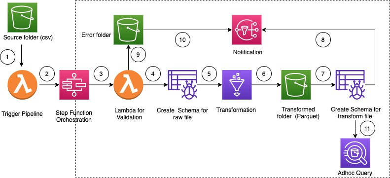
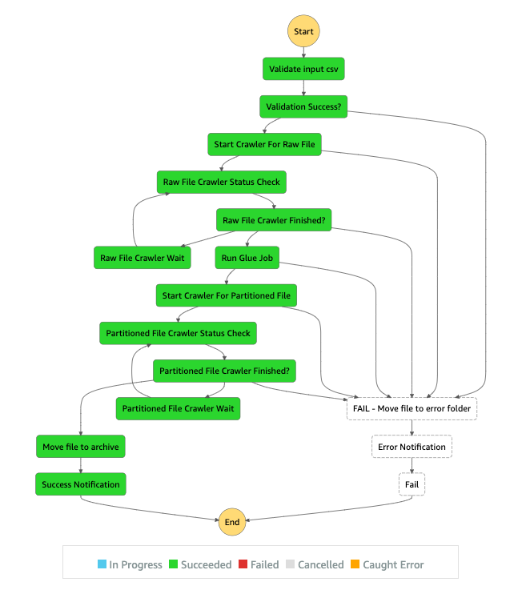
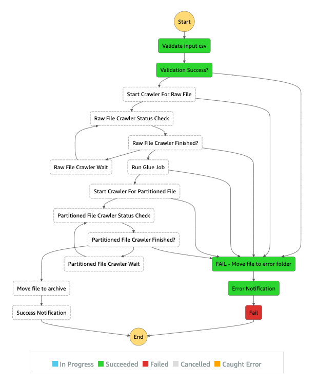

# ETL Pipeline with AWS Step Functions

This pattern explain how to build a serverless  ETL pipeline to validate, transform, compress, 
and partition large csv dataset for performance and cost optimization. 
The pipeline is orchestrated by serverless AWS Step Functions with error handling, retry and end user notification.
When a csv file is uploaded to AWS S3 (Simple Storage Service) Bucket source folder, ETL pipeline is triggered. 
The pipeline validates the content and the schema of the source csv file, transform csv file to compressed parquet format, 
partition the dataset with year/month/day  and store in a transformed folder for  analytics tools to consume.

---

## Sections
- [Prerequisites](#Prerequisites)
- [Limitations](#Limitations)
- [Product Versions](#Product-Versions)
- [Architecture](#Architecture)
- [High level work flow](#High-level-work-flow)
- [File Details](#File-Details)
- [Deploy](#Deploy)
- [Sample Workflow Execution](#Sample-Workflow-Execution-and-Notification)

## Prerequisites 

* An active AWS account with programmatic access
* AWS CLI with AWS account configuration, so that you can create AWS resources by deploying cloudformation stack
* Amazon S3 bucket 
* CSV dataset with correct schema ( attached is a sample csv file with correct schema and data type)
* Web browser
* AWS Glue console access
* AWS Step Functions console access

## Limitations
AWS Step Functions:

- Execution History: The maximum limit for keeping execution history logs is 90 days.
For more details refer: 
AWS Step Functions Limits Overview

## Product Versions
* Python 3 for AWS Lambda
* AWS Glue version

## Architecture

## High level work flow

1. User uploads a csv file. AWS S3 Notification event tiggers a AWS Lambda function 
2. AWS Lambda function starts the step function state machine
3. AWS Lambda function validates the schema and data type of the raw file
4. AWS Glue Crawler create the schema of the raw file and move the file to stage folder
5. AWS Glue job transform, compress and partition the raw file into Parquet format
6. AWS Glue job also move the file to transform folder.
7. AWS Glue Crawler create the schema from the transformed file . The Resulting Schema can be used by analytics job
8. AWS SNS sends succesful notification
9. File moved to error folder if validation fails
10. AWS SNS sends error notification for any error inside workflow
11. Amazon Athena used for any adhoc query on partitioned dataset. 

## File Details
- template.yml - CloudFormation template file
- parameter.json - File that contains all the parameters and their value. This file needs to updated to change the parameter value as described below
 - myLayer - This folder contains python packages need to create the required lambda layer for this project
 - lambda - This folder contains the following lambda function
    - move_file.py - Moves the source dataset to archive/transform/error folder 
    - check_crawler.py - Check the status of AWS Glue crawler
    - start_crawler.py - Start the AWS Glue crawler
    - start_step_function.py - Starts AWS Step Functions.
    - start_codebuild.py - Start AWS CodeBuild Project
    - validation.py - Validates input raw dataset. 
    - s3object.py - Creates required directory structure inside S3 bucket
    - notification.py - Sends Success or Error notification at the end of Pipeline.

## Deploy
This pattern can be deployed through AWS Cloudformation. See the attachment for the Cloudformation template file.

Follow the below step to deploy this pattern using Cloudformation template

1.	Clone the Repo
2.	Navigate to the Directory
3.	Update parameter.json file as follows - 
    - pS3BucketNamen - Unique bucket name. This bucket will be created to store all the dataset. As, S3 Bucket name is globally unique, provide a unique name.
    - pEmailforNotification - A valid email address to receive success/error notification.
    - pSourceFolder - Folder name (inside bucket created mentioned in 3.a) where source csv file will be uploaded inside 
    - pStageFolder - Folder name (inside bucket created mentioned in 3.a) used to staging area for AWS Glue Jobs 
    - pTransformFolder - Folder name (inside bucket created mentioned in 3.a) where transformed and portioned dataset will be stored 
    - pArchiveFolder - Folder name (inside bucket created mentioned in 3.a) where source csv file will be archived 
    - pErrorFolder - Folder name (inside bucket created mentioned in 3.a) where source csv file will be moved for any error 
    - pDatasetSchema - Valid schema of the source dataset. **Note** - For source dataset validation, cerberus python package has been used. For more information, refer [cerberus site](https://cerberus-sanhe.readthedocs.io/usage.html#type)

4. Execute the following AWS CLI command with pre-configured AWS CLI profile. 
    - Replace "Profile_Name" with a valid aws cli profile name
    - Replace "Stack_Name" with Proide a unique stack name
    - Replace "existing_bucket_name_in_the_same_region" with an existing S3 bcuket name in the same region where the stack will be deployed

    *aws cloudformation package --template-file template.yml --s3-bucket <**existing_bucket_name_in_the_same_region**> --output-template-file packaged.template --profile <**Profile_Name**>*

    *aws cloudformation deploy --stack-name <**Stack_Name**> --template-file packaged.template  --parameter-overrides file://parameter.json --capabilities CAPABILITY_IAM --profile <**Profile_Name**>*
7.	Check the progress of CloudFormation stack deployment in console and wait for it to finish

## Test

1. Once, stack deployment is completed, navigate to source folder inside S3 bucket ( which was provided in Step 3a above)
2. Upload a sample csv file with valid schema ( a sample file Bank_Transaction.csv is attached) to trigger the ETL Pipeline through AWS Step Functions.
3. Check the ETL pipeline status in the AWS Step Functions.
4. Once ETL pipeline completes, partitioned dataset will be available in transform folder inside S3 Bucket ( set in Step 3a)
Partitioned Table will be available in AWS Glue Catalog. 
5. Optionally, Amazon Athena can be used for adhoc query on the partitioned/transformed dataset

---
## Sample Workflow Execution and Notification
### Successful Execution

### Failed Execution with input validation error

### Sample Success Notification

{"msg": "File moved to archive/Bank_Transaction.csv", "executionname": "3d16677e-f159-4e42-ac7d-bc1b15b8310d", "status": "SUCCESS"}

### Sample Error Notification
{"msg": "File moved to error/Bank_Transaction_1.csv", "executionname": "47c4bcb8-9689-4a8d-b5f2-6ebec0e4f408", "status": "FAILURE"}

## Security

See [CONTRIBUTING](CONTRIBUTING.md#security-issue-notifications) for more information.

## License
This library is licensed under the MIT-0 License. See the LICENSE file.

